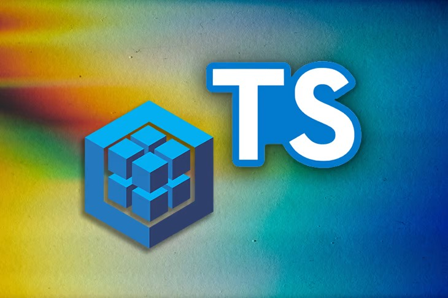

<div align="center"> 
    
</div>

<br>
<br>

## Sobre o projeto:

Esse projeto foi desenvolvido para aplicação dos conceitos aprendidos sobre Docker, Typescript, Sequelize, NodeJS e MySQL. A parte de frontend foi toda feita pela equipe da Trybe. 

Implementei todo o backend para suprir o frontend.

---

# Tecnologias usadas:
- [SQL](https://www.w3schools.com/sql/)
- [MySQL Workbench](https://www.mysql.com/products/workbench/)
- [NodeJS](https://nodejs.org/en/about/)
- [Sequelize](https://sequelize.org/)
- [Typescript](https://www.typescriptlang.org/docs/)
- [Docker](https://docs.docker.com/)

#

# Lições desenvolvidas:
 - Entender o funcionamento do banco de dados com Typescript;
 - Delegar responsabilidades específicas para essa camada;
 - Estruturar uma aplicação em camadas usando conceitos de CRUD;
 - Delegar responsabilidades específicas para cada parte do seu app;
 - Melhorar manutenibilidade e reusabilidade do seu código;
 - Entender e aplicar os padrões REST;
 - Escrever assinaturas para APIs intuitivas e facilmente entendíveis.
#

# Instruções

```bash
    # Clonar repositório

    $ git git@github.com:CrisSouzaMA/trybe-tfc.git

    # Entrar no diretório

    $ cd app

```

<br>
<br>
<br>
